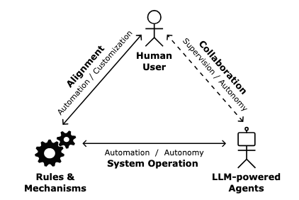
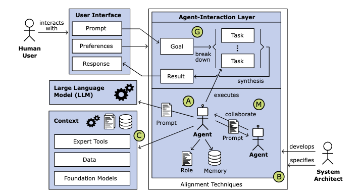
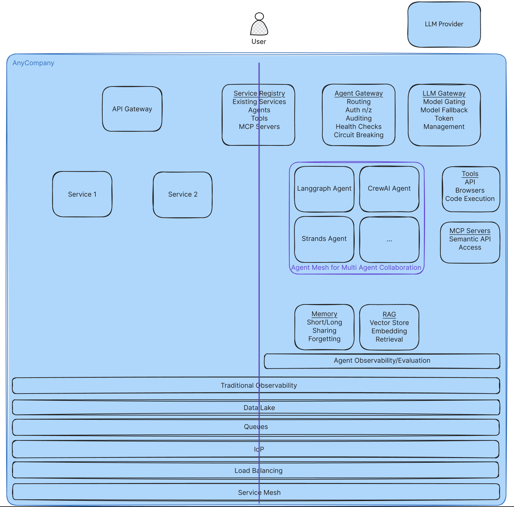
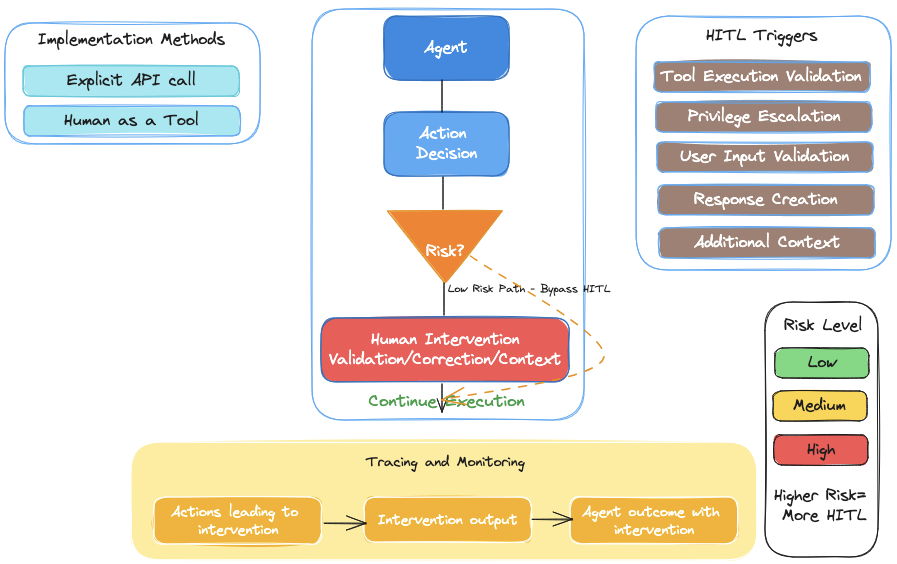
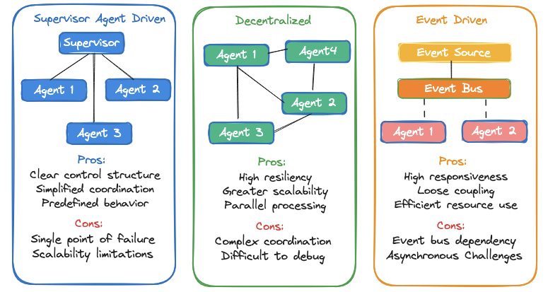

# Evolving System Architecture: Integrating Agents into Workflow Systems

## 0. Abstract

The landscape of system design has undergone a fundamental transformation from rigid, deterministic workflows, to adaptive, intelligent architectures capable of emergent behavior. This evolution represents a paradigm shift from purely rules-based systems, through AI-enhanced workflows, to autonomous agent-based frameworks that address open-ended problems with flexibility and creativity.

Traditional rules-based workflows operate within the confines of explicitly programmed logic; they follow predetermined decision trees and conditional statements. While reliable and predictable, these systems inherently limit their creators' ability to anticipate and codify every possible scenario. The introduction of generative AI marks the first major disruption to this paradigm, enabling systems to process natural language inputs and generate contextually appropriate responses, though still within relatively constrained parameters.

The emergence of agent-based architectures represents the next evolutionary leap, fundamentally redefining what automated systems can accomplish. Unlike traditional workflows that follow linear, predefined paths, or early AI implementations that enhanced specific tasks, agents possess the capacity for autonomous decision-making, dynamic goal adaptation, and emergent problem-solving behaviors that their designers never explicitly programmed.

This document equips technical leaders and architects with insights into differentiated characteristics of an agent-based system and what additional infrastructure and operational components one needs to consider while building an agent-based system.

**Key Takeaways:**

* Understanding of agentic systems' distinct characteristics
* Essential infrastructure and operational requirements for successful agent implementations
* Critical considerations for security, observability, and human oversight

Through this analysis, organizations can better position to make informed decisions about adopting agent-based architectures and managing the transition from traditional rules based and deterministic workflows to AI agentic systems.

## 1. Introduction

AI-based workflows represent a significant advancement, integrating traditional deterministic workflows with the capabilities of Large Language Models (LLMs). These workflows demonstrate enhanced adaptability, enabling them to effectively manage intricate tasks with the ability to drive business optimization. They excel in well-defined, repetitive tasks characterized by minimal variation and the necessity of consistent outcomes.

In contrast, autonomous agent-based systems break free from the constraints of pure rules-based thinking, enabling emergent behavior through the interaction of multiple specialized agents. Each agent, powered by LLM capabilities and enhanced with contextual resources, contributes to a collective intelligence that dynamically decomposes and solves complex problems. This approach introduces a new paradigm whereby solutions emerge from collaborative interaction of autonomous agents, instead of by prescribed, rigid rules.

### 1.1 What Are Agents and How Do They Differ From LLMs?

An AI agent contains an LLM as its reasoning core, but extends it with:

* Memory system for context retention - unlike stateless LLMs, agents track context and remember previous interactions/decisions
* Tool integration for external capabilities - agents interact with external systems (APIs, databases, software) to accomplish tasks
* Planning and orchestration logic for complex tasks - agents make decisions and execute actions without requiring human input for every step

[Image: agentsvllms.png]
Unlike LLMs, agents follow a process of:

* Perception - gather information from the environment or tools.
* Process - use an LLM to reason about the situation.
* Act - select and use tools or actions to perform the objective.
* Learn - update and persist the state to benefit future processes.

|Characteristics	|LLM	|Agent	|
|---	|---	|---	|
|Behavior	|Reactive	|Proactive	|
|Conversation	|Single Turn	|Multi-step planning and execution	|
|Capabilities	|Text generation	|Uses tools to perform actions	|
|Memory	|Limited by context window	|Maintains memory	|

The process loop creates increasingly effective behavior over time. Utilizing multiple, purpose built agents, enables creating autonomous systems that are able to accomplish broader goals.

### 1.2 System Design

When building systems with multiple AI agents powered by LLMs, organizations face an important challenge: how to balance letting the AI agents work independently while ensuring they do what humans want them to do.

Imagine three players in this situation (Fig. 1):
1. The human users who want tasks done.
2. The AI agents that can independently think and work.
3. The rules and guidelines that keep everything running smoothly.

On one hand, organizations want AI agents to be independent enough to figure things out - giving them the freedom to solve problems their way. This is called "autonomy": can the AI handle new situations without needing human help?

On the other hand, organizations need to make sure these AI agents stay on track and do what is intended of them. This is called "alignment": ensure a helper acts in the manner intended.

There are two kinds of alignment to consider:
1. Basic rules that the system developers build in ("don't share private information").
2. Personal preferences that each user can set ("always confirm before making big decisions").

**Source: Thorsten Händler, [Balancing Autonomy and Alignment(p7)](https://arxiv.org/pdf/2310.03659)**
*Fig. 1. Balancing autonomy and alignment to human intention and values*

Organizations can use the below matrix to balance AI autonomy with human goals. This matrix puts autonomy levels on one axis (horizontal) and alignment levels on the other axis (vertical). The approach works well for Large Language Model (LLM) systems that use multiple AI agents. Each point in the matrix shows how much freedom and control to give the AI. Händler (Oct 2023) explains this framework in detail in the paper "Balancing Autonomy and Alignment". LLM enabled workflows will typically fall in the L1: Adaptive Autonomy level and Agents in the L2: Self-Organizing level.

|Level of Autonomy & Alignment	| L0: Static	           | L1: Adaptive	             | L2: Self-Organizing	 |
|---	|-----------------------|---------------------------|---------------------|
|**L0: Integrated**	| Rule-Driven Automation	 | Pre-Configured Adaptation	 | Bounded Autonomy	   |
|**L1: User-Guided**	|User-Guided Automation	|User-Guided Adaptation	|User-Guided Autonomy	|
|**L2: Real-time Responsive**	|User-Supervised	|User-Collaborative Adaptation	|User-Responsive Autonomy	|

A well-designed multi-agent AI system rests on four core architectural pillars:

* **Agent Composition** establishes the foundation by defining specialized agent roles, managing their memory requirements, and structuring their hierarchical relationships. This framework must support dynamic scaling as the system grows or task complexity increases.
* **Multi-Agent Collaboration** structures how these agents work together. It implements standardized communication protocols and intelligent task distribution while providing robust mechanisms for conflict resolution and quality control. This ensures that multiple agents can work harmoniously toward common goals while maintaining output consistency.
* **Context Interface** manages how agents access and utilize external data sources, specialized tools, and additional AI models. It maintains contextual awareness across agent interactions while ensuring efficient resource distribution and access control.
* **Goal Driven Task Management** breaks down user goals into manageable subtasks, tracks dependencies, orchestrates execution, and synthesizes results into coherent responses. This component acts as the system's central nervous system, coordinating all activities toward achieving user objectives.

**Source: Thorsten Händler, [Balancing Autonomy and Alignment(p6)](https://arxiv.org/pdf/2310.03659)**
**Fig. 2. Characteristic of a multi-agent system. A=Agent Composition, M=Multi-Agent collaboration, C=Context interface, G=Goal driven task management, B=Balancing between Alignment and Autonomy**
**
The system design must address critical operational considerations including performance optimization, error handling, security, and monitoring. These elements ensure the system remains reliable and maintainable while effectively handling complex, interconnected tasks. Success depends on careful balance between these components, creating a flexible system that can evolve with changing requirements while maintaining consistent performance.

## 2. Building Blocks of Agentic Systems

An agentic AI system is composed of one or more agents working together to accomplish a one time (*make travel arrangements for my trip*), asynchronous (*update a code base from Java 11 to Java 17*), perpetual (or otherwise) task (*always monitor this network and take actions to maintain network health*). In addition to the LLM that drives the agent loop, agents are composed of some common building blocks such as tool, memory, session management, identity, and observability. This section explores both the infrastructure and operational building blocks of agentic systems.

### 2.1 Infrastructure Components

The diagram above highlights a multi-tenant, workflow based system with emergent, agentic capabilities. On the left side of the line down the middle are components that are more workflows based systems, on the right side are new components for agentic systems. In the middle are components that are common to both, but may have some capabilities that need to be added to them.

#### 2.1.1 Agentic Services

**Agent Gateway** - Acts as the primary entry point for all agent interactions. The agent gateway provides a registry for agents, tools and Model Context Protocol (MCP) servers with authentication and authorization. The centralization of managing all these agentic services enables a central point to enforce proper auditing (logging) of all tool and agent requests. It supports standard service requirements such as health monitoring, rate limiting, versioning, and circuit breaking for handling failures.

**Agents -** The core agentic services. Agents are containerized applications running in an event driven, asynchronous manner. They interact with the agent gateway to access other agents and services, as well as the LLM gateway to access LLMs for processing.

**LLM Gateway** - Manages all communication with LLMs. The LLM gateway enables intelligent request caching that can be shared amongst models and services. Similar to the agent gateway, centralizing LLM access enables enforcing security such as prompt injection protection and content filtering. Additionally, it can be used to track API keys for tasks and teams as well as pick appropriate models to route to based on the requirements and costs.

**Memory** - Dedicated storage systems for agent memory. The memory service handles short-term and long-term memory in either an ephemeral or persistent manner. It supports memory sharing with appropriate permissions, contextual memory retrieval, and memory prioritization for effective context use. Finally, it supports forgetting to allow outdated information to be dropped.

**RAG (Retrieval Augmented Generation) -** **** Knowledge storage and retrieval systems. The RAG service is a vector store for document embeddings which enables searching over additional organizational context to augment an LLM’s knowledge.

**Agent Observability** - Specialized monitoring for agent-specific metrics. Agent observability tooling enables augmenting traditional observability for storing agent based metrics, logs, and traces, as well as storing the same from the agent gateway and LLM gateway. It provides a way to track and associate token use with quality as a way to calculate value of the agent. By tracking task completion rates, errors, user feedback, and enabling prompt management, it enables teams to get a holistic view of how their agentic system is performing. Observability should be a cornerstone of enabling evaluation metrics for agent performance, LLM as a Judge (LLMaaJ), and RAG.

#### 2.1.2 Common Services

**Service Registry** - New services need to be added to traditional registries. A central registry and management console for AI agents, tools, and MCP servers needs to support governance, transparency, discoverability, and lifecycle management. It maintains a certified catalog of agents with essential metadata including identity, capabilities, ownership, and access permissions. The registry functions as the central hub for enforcing security policies, compliance checks, performance tracking, and agent lifecycle management.

**Traditional Observability**- Existing observability platforms need to be updated to support ingestion of the agent observability metrics, logs, and traces and correlating them with the existing services of the environment, as well as the observability logged from the agents’ containers.

**Data Lake**- Traditional data sources need to be augmented to support secure access for agents. Data lineage needs to be available to understand both how the service (agent) and the user who used the service accessed the data and why. Understanding whether the right data was retrieved for the given request ensures that agents are presenting the correct data and that the agent is being valuable.

**Queues**- Agentic architectures require event-driven support. A messaging system needs to be available for agents as their communication may time out traditional HTTP communication. Enabling priority queues allows critical agent tasks to happen first, while supporting dead letter queues for errors is imperative. Finally, the ability to replay events is critical for time traveling and debugging agent interactions.

**Identity Provider (IdP)**- Identity needs to support agents, tools, and user roles and scopes. Agents act on behalf of users, allowing access to tools, data, and other agents. Enabling support for this fine-grained control is imperative to ensuring systems stay secure. Just-in-time privilege elevation enables HITL (human in the loop) to approve riskier agentic capabilities.

**Load Balancing** - Stochastic reasoning requires new load balancing techniques. As agents have non-deterministic processing times for similar inputs, load balancing needs to be aware of the current load of an agent rather than using traditional round-robin load balancing.

**Service Mesh**- Service mesh features such as circuit breaking traffic policies enable more robust agentic infrastructures. Agentic protocols such as MCP and A2A require layer 7 routing (more on communication below).

### 2.2 Communication Protocols

Several communication protocols between agents and tools and agents to agents exist:

[**MCP:** Model Context Protocol](https://modelcontextprotocol.io/) is an open standard designed to streamline and standardize how AI applications-such as chatbots, IDE assistants, and custom agents-connect with external tools, data sources, and systems (and potentially agents, soon). MCP addresses the “MxN” integration problem by introducing a universal protocol that transforms the challenge into a simpler "M+N" scenario: tool creators build MCP servers for each system and application developers build MCP clients for each AI application; thereby allowing any compliant model to interact with any compliant tool without bespoke code.

[**A2A**: Agent to agent](https://github.com/google/A2A) is an open protocol developed by Google and partners to allow AI agents to securely communicate, exchange information, and coordinate actions. Designed to overcome the challenges of deploying large-scale, multi-agent systems, A2A provides a standardized foundation for agent discovery, task negotiation, and collaboration, while preserving agent opacity and security. It uses familiar technologies (JSON-RPC 2.0 over HTTP/S, Server-Sent Events) and introduces the **Agent Card** for capability discovery and **Artifacts** for structured results. The protocol is open-source and community-driven, aiming to foster a more interconnected AI ecosystem.

[**ACP**: Agent Connect Protocol](https://github.com/agntcy/acp-spec) is developed as part of [AGNTCY](https://github.com/agntcy), an open-source, multi-company initiative, to create the foundational infrastructure for an “Internet of Agents.” It focuses on establishing open standards and protocols that allow diverse AI agents to discover, communicate, and collaborate across platforms and organizations. AGNTCY’s architecture is built on two main specifications: the Open Agent Schema Framework (OASF) for standardized agent metadata and the Agent Connect Protocol (ACP) for secure, robust agent communication. The initiative emphasizes security, scalability, and composability, enabling developers to build, deploy, and monitor complex multi-agent workflows with confidence.

A comparison of the three follows:

|Feature	|Model Context Protocol (MCP)	|Agent2Agent (A2A) Protocol	|AGNTCY	|
|---	|---	|---	|---	|
|Primary Focus	|Agent/Model to Tool/Data Integration	|Agent-to-Agent Communication/Collaboration	|Full Ecosystem Infrastructure	|
|Originator(s)	|Anthropic	|Google (+ Partners)	|Open Collective (Cisco, LangChain, LlamaIndex, Galileo, and many others.)	|
|Scope	|Focused Protocol Standard	|Focused Protocol Standard	|Comprehensive Suite of Protocols & Services	|
|Core Interaction	|Tools, Resources, Prompts	|Tasks, Messages, Parts, Artifacts	|ACP (Invocation, Interrupts) + AGP(Agent Gateway Protocol) Transport	|
|Architecture	|Client-Host-Server	|Direct Client-Server	|Layered (ACP/AGP/Gateway/Directory/OASF)	|
|Primary Transport	|Stdio, HTTP+SSE	|HTTP(S) + SSE	|ACP (REST-like) over AGP (gRPC/HTTP/2)	|
|Message Format	|JSON-RPC	|JSON-RPC	|ACP (JSON, natural language) + AGP (Protobuf likely)	|
|Discovery	|Host connects to known Servers	|Agent Card @ well-known URL	|Agent Directory + OASF Manifests	|
|Key Security Locus	|Host Enforcement, User Consent	|Standard Web Security (HTTPS, Auth Schemes)	|Infrastructure (Gateway), Planned Frameworks	|
|Advanced Security	|Standard Web Auth (OAuth)	|Standard Web Auth (OAuth)	|Stated AGP goals: E2E Encrypt, MLS, Quantum Safe	|

Successfully integrating agentic AI into traditional workflows requires both specialized new services and enhancements to existing infrastructure. Enhancing traditional services to support emergent behaviors requires a focus on security, asynchronous architectures, discoverability, and observability.

## 3. Unique Considerations for Agentic Systems

Successful implementation of agentic systems requires careful considerations due to the unique nature of these systems. This section goes into some of the technical and operational challenges of implementing agentic systems as well as how to mitigate some of the potential challenges.

### 3.1 Technical Challenges

#### 3.1.1 Non-deterministic Behavior - Balancing Agent Independence With System Control

Foundation models (FM) are inherently stochastic: there is a fundamental randomness in their output even when using the same input and same set of inference parameters across multiple runs. This poses a challenge as organizations build more and more complex generative AI systems using FMs because of the desire for these systems to produce reliable/deterministic outputs while being driven by stochastic models.
Evaluations become an important step towards addressing the inherent non-deterministic behavior. There are several open-source agent benchmark datasets ([Taubench](https://sierra.ai/blog/benchmarking-ai-agents), [SWE-bench](https://www.swebench.com/), others) and evaluation frameworks ([Agent Eval](https://github.com/awslabs/agent-evaluation),  Holistic Agent Leaderboard ([HAL](https://hal.cs.princeton.edu/))) that help with agent evaluations.
Regarding reliability metrics:

* Capability a.k.a Pass@k: if the agent is able to successfully complete a task in at least 1 out of k attempts.
* Reliability a.k.a Pass^k: if the agent is able successfully complete a task in all k out of k attempts.

The higher the capability score, the more likely an agent is to accomplish a task successfully. Ensuring that agents are continuously evaluated before and after deployment is imperative to successful agentic systems.

#### 3.1.2 Cross-Boundary Tracing

All agent frameworks provide traces that contain a representation of the tool to call at any given step and the parameters to pass that tool. These traces can be compared against a ground truth or evaluated by an LLMaaJ to determine the accuracy of the tool selection and usage. This metric is a derived metric; it would need to be determined by an agent evaluation framework. As agents work with LLMs and other external systems, there may be gaps in traces that are sent externally.
Observability solutions which can visualize this information and export it to other solutions are important for ensuring agentic systems are running properly. They help track latency and expose regressions. They help identify models that perform faster, while giving outputs that are still accurate. Most of the observability solutions are integrated into the agent by instrumenting the code. Solutions such as LangSmith, Langfuse, Helicone, Weave, Phoenix, Opik, OpenLLMetry, and several others can be used for agent observability.

#### 3.1.3 Self-Assembling Workflows

Self-assembling workflows refer to the ability of agents to find other agents at runtime through an agent registry if they are assigned a task that they cannot accomplish given the tools they have. Agents can then communicate with other agents through an inter-agent protocol to collaboratively complete tasks. The ability to self-assemble workflows is critical to building reusable, autonomous, emergent systems.
Supporting this functionality requires control plane infrastructure such as an agent gateway and registry that provide a protocol for these agents to communicate and handle governance aspects such as passing authentication credentials and ensuring no access control rules are breached.

### 3.2 Operational Considerations

#### 3.2.1 Security Considerations

Agentic AI security concerns require organizations to implement robust risk management strategies, including multi-layered security frameworks and careful limitations on AI autonomy in high-risk scenarios. The balance between leveraging AI capabilities and maintaining security remains a critical challenge along a multitude of dimensions:

* **Data Integrity and System Exploitation:** agents can be vulnerable to malicious actors and made to perform harmful tasks. The addition of agentic entrypoints creates a larger attack surface.
* **Privacy and Data Protection**: agents are given access to data and may retrieve unauthorized data.
* **Autonomy-Related Risks**: agent autonomy may lead to undetermined data access.
* **Systemic and Operational Risks**: agents interacting with traditional services add another vector for more sophisticated attacks or disruptions.
* **Transparency and Trust Issues**: agent autonomy makes it hard to keep track of the decision-making process, especially with lack of visibility across systems. When an incident happens, who is to blame?
* **Compliance and Governance Challenges**: regulatory requirements are rapidly evolving to incorporate autonomous systems.
* **Tool Poisoning**: external services introduced in agentic systems may have security vulnerabilities or intentionally placed malicious code to attack systems.

These are just some of the risks in an agentic architecture. Security should be addressed at multiple levels to protect across multiple threat levels

A combination of the following approaches helps address the challenges listed above.

* **Network security**: deploy the agent in a secure virtual private cloud (VPC) so that it is solely accessible from allow listed endpoints. If the agent services external customers, access to the agent should be controlled via an API Gateway connected to an OAuth 2.1 compliant identity provider issuing access token to an application.
* **IAM Based Access Control** **for Service to Service Authentication**: the agent is accessible to services that use an IAM role that has authorization to access the agent.
* **Data Security**: all data sent to or received from the agent is encrypted in transit and at rest. When a tool accesses another system via an API then that message exchange is also encrypted via TLS.
* **Observability**: metrics, logs, and traces are critical to ensuring secure systems. Access to them should be secured and privacy protecting.
* **Responsible AI (RAI)**: associate agents with Responsible AI Guardrails providing functionality such as: topic adherence, content filtering, sensitive information redaction, and preventing jailbreaks. Associate RAI Guardrails (such as [NVIDIA NeMo guardrails](https://developer.nvidia.com/nemo-guardrails)) with an agent so that they are implicitly triggered upon agent invocation (for example from a chatbot based on user input).
* **Curated Tool/MCP/Agent Registries**: similar to traditional supply-chain security, solely allow known servers and services to be used.
* **Task Based Access**: Authorization/authentication should be evaluated per task. Access should be finely scoped and short lived.
* **Dynamically Adjustable Security**: Security should adjustable to give differing levels of control based on task risk as well as system threat levels.

#### 3.2.2 Cost Management (Compute + LLM Usage)

Cost and latency metrics are especially important in the context of agent evaluations as compared to model evaluations because a single agent invocation usually results in several calls to potentially multiple LLMs. An agent may also successfully accomplish a task by following a non-optimal trajectory or having a self-reflection pattern which allows it to correct errors, thus taking more steps than required in the most optimal scenario. Having additional steps in completing a task results in additional cost and latency. The latency metric is emitted by all agent frameworks as part of the agent invocation response. The cost metric is a derived metric. The HAL (Holistic Agent Leaderboard) provides:

* Cost-controlled and reproducible evaluations, with detailed logging, cost tracking, and automated failure analysis.
* A public leaderboard that allows for transparent comparison of agent performance on accuracy and cost, with in-depth failure analysis and encrypted trace sharing to protect benchmark integrity.

This allows organizations to identify candidate models for testing in their agentic systems that may address their needs.

#### 3.2.3 Performance Metrics

Along with cost, understanding performance is the way to identify if the agentic system is providing value. Doing so requires an evaluation of a few metrics:

**Token Counts**: Prompt and generation token counts are the core metrics tracked for every step of an agent invocation. These metrics are emitted by all agent frameworks as part of the agent invocation response.

**Task Completion Accuracy**: Assesses whether an agent successfully achieved its assigned goal. The specific evaluation method varies based on the benchmark dataset being used. For example, in the [USACO](https://hal.cs.princeton.edu/usaco) coding benchmark, accuracy is measured by the agent's code passing predefined unit tests with specific input-output pairs. This is a derived metric.

**Tool Selection Quality (TSQ)**: TSQ is a compound metric that refers to how accurately an LLM selected the correct tool and how often it passed the correct parameters (values, data types) to the tool. All agent frameworks provide traces that contain a representation of the tool to call at any given step and the parameters to pass to that tool. These traces can be compared against a ground truth or evaluated by a LLMaaJ to determine the accuracy of the tool selection and usage. This is a derived metric.

**Trajectory Evaluation Score**: Trajectory refers to the sequence of steps followed by an agent to accomplish a task. This sequence can be compared with an available ground truth and reasoned upon by an LLM evaluator as part of trajectory evaluation. Trajectory evaluators provide a trajectory evaluation score per task which can then be averaged over a benchmark dataset to determine how efficient an agent is in accomplishing tasks in a given benchmark. This is a derived metric.

**Responsible AI Guardrail Violations**: Guardrails are associated with an AI agent and guardrail violations (such as hitting denied topics, including PII information, or failing content moderation) are important metrics to track for an agent. This metric is a derived metric.

Understanding these metrics along with the cost component of a LLM will allow organizations to gauge the effectiveness of their agents. Selecting a different LLM, changing the prompt, or different memory strategies may be required to increase an agent’s performance.

#### 3.2.4 Human in the Loop Mechanisms (HITL)

HITL interventions are used for agents when they require human validation while executing a tool, escalating privileges for data access, validating user input before acting on it, making a correction on a previous response, or when seeking additional context.

Agent frameworks typically implement HITL in one of two ways: with an explicit instruction provided by the Agent SDK or as a step implemented as a tool. The riskier an action is, the more likely HITL needs to be invoked. Tracing agent actions leading to HITL intervention, the output of the intervention, and the outcome of the agent enables organizations to understand whether there is continued need for this mechanism.

#### 3.2.5 Agent Orchestration

Agent orchestration refers to the coordination, management, and workflow control of one or more AI agents to accomplish complex tasks. Three commonly used approaches for agent orchestration are:

* **Supervisor Agent Driven Orchestration**: in a multi-agent system, a supervisor agent controls the workflow. It usually has some form of routing logic (either as part of its system prompt or an external intent classifier) to delegate tasks to collaborator agents.
* **Decentralized Orchestration**: a network of agents can communicate with each other based on predefined protocols without central controls. For example, a multi-agent system where agents negotiate and self-organize to complete tasks.
* **Event-Driven Orchestration**: Agent execution is triggered based on events, messages, or state changes. For example, an agent that gets triggered based on anomaly detected by a system that is published as an event on an event bus.

Choosing an appropriate orchestration strategy requires understanding the complexity of the task, the predictability of the workflow, the complexity of the implementation, along with the scalability needs.

## 4. Open System Design Questions

1. What protocols and interfaces should standardize agent discovery, authentication, and communication across platforms and organizations?
2. Is one registry for agents, tools, and MCP servers with shared metadata standards the right solution, or separate specialized registries for each component type?
3. How to implement secure, scalable access management when agents need to operate across organizational boundaries while maintaining proper authorization and audit trails?
4. Should agents maintain distributed state stores, rely on centralized memory systems, or use hybrid approaches - and how to ensure consistency during multi-agent collaboration?
5. What are the essential patterns for human oversight, approval workflows, and fail-safes that prevent autonomous agents from causing unintended consequences?
6. How to design cost controls, rate limiting, and resource allocation systems that work fairly across shared agent infrastructure?
7. Should agents be designed as model-agnostic with universal interfaces, or optimized for specific LLMs - and what abstraction layers enable maximum compatibility?

## 5. Conclusion and Next Steps

The transition from traditional rule based workflows to agent-based systems demands a carefully orchestrated approach that balances innovation with operational stability. Organizations can leverage existing infrastructure while building new capabilities through a structured evolution of their technical and operational framework.

Successful implementation begins with architectural flexibility. While current infrastructure components such as containerization, API management, and monitoring systems provide a solid foundation, organizations must extend these to support multiple protocol standards and emerging agent communication frameworks. This flexible architecture should accommodate both traditional workflow patterns and new agent interaction models, allowing for gradual transformation without disrupting existing operations.

The governance framework represents a critical bridge between existing and new paradigms. Traditional role-based access control and audit mechanisms must evolve to support more nuanced agent autonomy management. Organizations need to implement sophisticated control systems that can dynamically adjust agent freedom based on context, risk level, and operational requirements. This includes developing new monitoring approaches that can track both deterministic workflows and emergent agent behaviors.

Evaluation infrastructure requires significant enhancement to address the unique characteristics of agent-based systems. While existing testing frameworks and performance monitoring tools provide a starting point, organizations must develop new capabilities for assessing agent collaboration, measuring autonomous decision quality, and validating emergent behaviors. This involves combining automated testing with human oversight in novel ways, particularly for critical operations where agent actions must align precisely with organizational objectives.

The human and organizational aspects of this transition cannot be overlooked. Success requires developing new roles and capabilities specifically focused on agent operations, while maintaining expertise in traditional systems. Organizations should foster a culture that balances experimentation with operational discipline, creating space for innovation while ensuring reliability. This often means establishing dedicated teams that can bridge the gap between traditional IT operations and agent-based systems.

The “Agentic Community” initiative will explore the open system design questions presented in the document and construct publicly hosted reference architectures and implementations with accompanying code. Its objective is to provide clarity in system design through published reference materials, thereby offering a broader platform for influencing the industry and ecosystems.

## References and Further Reading

Agentic AI Identity Management Approach (March 11, 2025) Retrieved May 19, 2025, from https://cloudsecurityalliance.org/blog/2025/03/11/agentic-ai-identity-management-approach

Buddhika “From Microservices to AI Agents: A Natural Evolution for Developers” Medium, December 29, 2024.

Cerny, T., Goulis, G., Abdelfattah, A.S. (2025). Towards Change Impact Analysis in Microservices-based System Evolution. arXiv preprint arXiv:2501.11778.

Deng, Z., Guo, Y., Han, C., Ma, W., Xiong, J., Wen, S., & Xiang, Y. (2025). Ai agents under threat: A survey of key security challenges and future pathways. ACM Computing Surveys, 57(7), 1-36.

Fowler, M., & Lewis, J. (2014). Microservices: a definition of this new architectural term. Retrieved May 9, 2025, from https://martinfowler.com/articles/microservices.html

GRPC (n.d.). Retrieved May 9, 2025, from https://grpc.io/docs/languages/go/basics/

Händler, T. (2023). Balancing Autonomy and Alignment: A Multi-Dimensional Taxonomy for
Autonomous LLM-powered Multi-Agent Architectures. arXiv preprint arXiv:2310.03659.

Richardson, C. (2019). Microservices Patterns: With examples in Java. Manning Publications.

[Solo.io](http://solo.io/) (April 24, 2025). Retrieved May 18, 2025, from https://www.solo.io/blog/agent-mesh-for-enterprise-agents

Swagger (n.d.). Retrieved May 9, 2025, from https://swagger.io/docs/open-source-tools/swagger-codegen/codegen-v3/about/

Yang, Y., Chai, H., Song, Y., Qi, S., Wen, M., Li, N., Liao, J., Hu, H., Lin, J., Chang, G., Liu, W., Wen, Y., Yu, Y., Zhang, W. (2025). A Survey of AI Agent Protocols. arXiv preprint arXiv:2504.16736.
